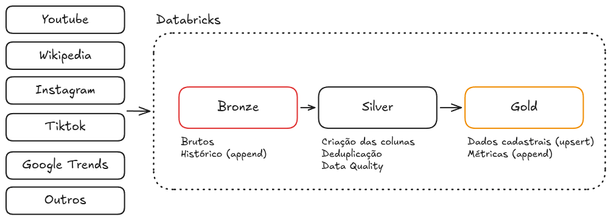
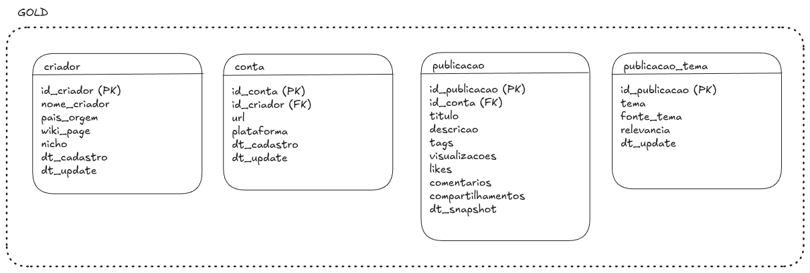

# Arquitetura de Dados — Creators Pipeline

Pipeline para ingestão e atualização contínua de dados de criadores de conteúdo e suas publicações, coletados a partir de APIs e Wikipedia.

---

## Sumário

1. [Visão Geral](#visão-geral)
2. [Orquestrador](#orquestrador)
3. [Modelagem de Dados](#modelagem-de-dados)
4. [Extração de Dados](#extração-de-dados)
5. [Etapas do Pipeline](#etapas-do-pipeline)
6. [Monitoramento e Qualidade](#monitoramento-e-qualidade)
7. [Boas Práticas](#boas-práticas)

---

## Visão Geral

Vou utilizar como base o processo de Wikipedia e Youtube realizado anteriormente mas sabendo que podemos ter diversas origens, para complemento das informações: Instagram, TikTok, além de outras Wikis de Fandom, Google Trends.

A arquitetura seguiria o padrão **Medalhão (Bronze / Silver / Gold)** no Databricks com tabelas Delta Lake.



A camada Bronze teria os dados brutos e mantidos imutáveis, garantindo dados não manipulados: se uma transformação Silver tiver bug, posso reprocessar a partir dos dados brutos sem precisar chamar a API / realizar o scrapping de novo. No caso dos resultados via scrapping e API, eu guardaria o HTML bruto ou o json de retorno do request como uma coluna (string) com metadados de rastreabilidade:
```
{
    "wiki_page": "Felipe_Neto",
    "url": "https://en.wikipedia.org/wiki/Felipe_Neto",
    "html": "<html>...</html>",
    "ingested_at": "2024-04-15T10:23:00"
}
```

O particionamento da bronze poderia ser por canal e data de ingestão, Já que, um reprocessamento é sempre por canal: se o parser do Instagram tiver bug, dá para reprocessar source=instagram/ inteiro, não vasculhar todas as datas misturadas com outros canais. Não acredito que 'criador' seja uma boa partição: se temos 300 criadores, partições de alta cardinalidade fragmentam demais os arquivos e degradam performance.
```
bronze/
├── source=youtube/
│   ├── ingestion_date=2024-04-15/
│   └── ingestion_date=2024-04-16/
├── source=wikipedia/
│   └── ingestion_date=2024-04-15/
└── source=instagram/
    └── ingestion_date=2024-04-15/
```

Na camada Silver, os dados da bronze seriam transformados em tabelas: extração informações / colunas a partir do HTML com regex, extração informações / colunas a partir do Json da API, tipagem dessas colunas, deduplicação das linhas, validações das urls extraídas (como a url do YouTube extraída do Wikipedia), alguns joins de enriquecimento (com os dados extraídos do Wikipedia), aplicação de dataquality (testes de unicidade e completude).

O particionamento seria o mesmo da bronze:
```
silver/
├── source=youtube/
│   ├── ingestion_date=2024-04-15/
│   └── ingestion_date=2024-04-16/
├── source=wikipedia/
│   └── ingestion_date=2024-04-15/
└── source=instagram/
    └── ingestion_date=2024-04-15/
```

Na camada Gold, os dados seriam agredados e modelados e teria duas estratégias para essa camada: os dados cadastrais seriam atualizados com MERGE INTO (UPSERT), já que nesse caso o estado atual é suficiente, e particionados por data de ingestão; e os dados de métricas de engajamento (likes, views, etc) com snapshot diário (append), para conseguir acessar as variações ao longo do tempo e construir boas soluções enquanto os vídeos estão em alta, e particionados pela data do snapshot.

---

## Orquestrador

**Escolha: Databricks Workflows**

Eu tenho bastante experiência na AWS e costumo utilizar o glue workflow para pipelines simples e que utilizam apenas o glue; ou step functions, para pipelines mais complexas (envonvendo muitos jobs, paralelismos e dependências) ou com outras ferramentas. O Airflow também é uma boa pedida em termos de orquestradores, principalmente quando o nível de complexidade da pipeline é alto, porém, nesse caso de arquitetura medalhão, o custo operacional de manter um Airflow separado não se justifica.

Porém, por estar no ecossistema Databricks, o Workflows é nativo e elimina a necessidade de infraestrutura adicional; se integra nativamente com os notebooks e as tabelas Delta do projeto, além de ter notificações, retry policies e dependências entre tasks, sendo assim a melhor opção.

O pipeline roda em dois modos:

- **Carga inicial**: execução única, coleta de histórico
- **Atualização incremental**: agendado diariamente via cron no Databricks Workflows

---

## Modelagem de Dados



### `gold.criadores`

Dados cadastrais de cada criador, atualizados a cada execução (upsert).

O `id_criador` seria o id único de cada criador que é monitorado pela empresa.

### `gold.conta`

Dados com as contas das diversas origens dos dados: youtube, instagram, tiktok, etc. Dados atualizados a cada execução (upsert).

O `id_conta` seria um id único, associado a url (do youtube, instagram, ou qualquer outro canal)
O campo `plataforma` seria apenas o nome do canal (instagram, youtube, tiktok, etc)


### `gold.publicacao`

Dados com todas as publicações, vinculadas às contas. Dados atualizados com append/snapshot para manter histórico das métricas das publicações.

### `gold.publicacao_tema`

Essa tabela normaliza temas variados em um tema comum entre plataformas.
A coluna `fonte_tema` é importante para rastreabilidade: você sabe se aquele tema foi extraído de uma tag explícita ou inferido por NLP.

---

## Extração de Dados

### Fontes

| Fonte | Dados extraídos | Método |
|---|---|---|
| Wikipedia | `creator_id` do YouTube por criador | Webscrapping / REST API (`action=parse`) |
| YouTube Data API v3 | Metadados do canal e vídeos | REST API |

### Carga Inicial

A carga inicial seria realizada a partir da lista de wiki_pages, buscando a partir disso os ids do YouTube. Com a API do Youtube eu buscaria os metadados do canal e o histórico completo de vídeos e suas informações: a carga inicial busca todo o histórico disponível de vídeos de cada canal, paginando até esgotar os resultados da API.

### Atualização Incremental

A cada execução diária, o pipeline busca apenas publicações novas:

```python
# Busca vídeos publicados após a última ingestão
published_after = last_ingested_at.strftime("%Y-%m-%dT%H:%M:%SZ")

params = {
    "part": "id",
    "channelId": channel_id,
    "publishedAfter": published_after,
    "order": "date",
    "maxResults": 50,
}
```

### Cotas da [API do YouTube](https://developers.google.com/youtube/v3/getting-started)

| Operação | Custo (unidades) |
|---|---|
| `channels.list` | 1 por canal |
| `search.list` | 100 por chamada |
| `videos.list` | 1 por chamada |
| Cota diária gratuita | 10.000 unidades |

---

## Etapas do Pipeline

Notebook 1 (extração e salva na Bronze) -> Notebook 3 (lê da Bronze, transforma e salva na Silver) -> Notebook 3 (lê da Silver, agrega e salva na Gold)

### Notebook 1 — Extração (Bronze)

- Lê `creators_scrape_wiki` para obter a lista de criadores
- Chama Wikipedia API para resolver `wiki_page` → `creator_id`
- Chama YouTube API para buscar metadados de canais e vídeos
- Grava resultado bruto em `bronze.creators_raw` e `bronze.posts_raw` (append com timestamp)

### Notebook 2 — Transformação (Silver)

- Lê Bronze, valida e limpa os dados
- Tipagem explícita de todas as colunas
- Remove duplicatas e registros inválidos
- Upsert via `MERGE INTO` nas tabelas Silver

### Notebook 3 — Agregação (Gold)

- Lê Silver e calcula agregações mensais por criador
- Garante que todos os meses do intervalo existam (cross join com calendário)
- Preenche meses sem posts com `num_posts = 0`
- Sobrescreve tabelas Gold com `overwrite`

---

## Monitoramento e Qualidade

### Qualidade dos Dados

Em cada notebook Silver, validações são executadas antes do upsert:

```python
# Exemplos de checks de qualidade
assert df.filter(F.col("creator_id").isNull()).count() == 0, "creator_id encontrado"
assert df.filter(F.col("likes") < 0).count() == 0, "likes negativos encontrado"
assert df.filter(F.col("published_at") > F.current_timestamp()).count() == 0, "data futura encontrada"
```

Se qualquer check falhar, o notebook levanta uma exceção e o Workflow marca a execução como falha — sem gravar dados inconsistentes.

### Monitoramento do Pipeline

| O que monitorar | Como |
|---|---|
| Falha em qualquer notebook | Alerta por e-mail no Databricks Workflows |
| Volume de registros ingeridos | Log no notebook + métrica no Delta history |   -> que que é Delta history?????
| Erros nas APIs | Contador de erros logado por execução |
| Schema | Schema fixo, falha explícita se mudar |

### Observabilidade

```python
# Ao final de cada notebook, loga um resumo da execução
print({
    "notebook": "2_transform_silver",
    "run_date": date.today().isoformat(),
    "creators_updated": creators_df.count(),
    "posts_inserted": new_posts,
    "posts_updated": updated_posts,
    "errors": error_count,
})
```

---

## Boas Práticas

### Gitflow

- `main`: código em produção, protegido — merge apenas via PR aprovado
- `develop`: branch de integração
- `homolog`: branch de testes, se necessário
- `feature/*`: uma branch por funcionalidade ou notebook
- `hotfix/*`: correções urgentes em produção

### Princípios de Engenharia

**Idempotência**: qualquer notebook pode ser reexecutado sem duplicar dados — garantido pelo `MERGE INTO` e pelo `overwrite` na Gold.

**Separação de responsabilidades**: cada notebook tem uma única responsabilidade (extrair, transformar ou agregar). Nenhum notebook lê e já grava Gold diretamente.

**Configuração centralizada**: credenciais (API keys) armazenadas em Databricks Secrets, nunca hardcoded. Parâmetros como datas e nomes de tabelas em um notebook de configuração importado pelos demais.

**Schema explícito**: todos os DataFrames têm schema definido com `StructType`. Nenhum `inferSchema=True` em produção.

**Bronze imutável**: a camada Bronze é append-only e nunca é modificada. Permite reprocessar Silver e Gold a qualquer momento a partir dos dados brutos originais.

**SOLID**: ?????